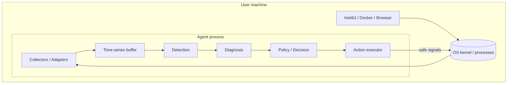
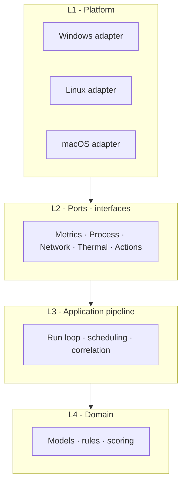

# Architecture overview

## Problem statement

Developers and power users experience **freezes, high CPU/RAM noise, disk saturation, or network waits**. A dumb “kill if RAM high” tool risks **data loss** and misses **root causes** (thermal throttling, indexing, leaks, etc.).

## Product goal

Build a **local observability and self-healing agent** that:

1. **Observes** CPU, memory, disk I/O, network, thermal (where available), and process state.
2. **Detects** abnormal *patterns* (not single spikes).
3. **Diagnoses** likely causes with **confidence** and **evidence**.
4. **Decides** using **policy** (notify → suggest → safe automated fix → kill as last resort).
5. **Learns** optional baselines per app (e.g. IntelliJ during indexing).

Design requirement: **one codebase**, **three targets** — Windows, Linux (e.g. Ubuntu), macOS — via a **stable core** and **pluggable adapters**.

## Design principles

| Principle | Meaning |
|-----------|---------|
| **Core is pure** | Detection/diagnosis rules do not import OS APIs. |
| **Adapters normalize** | All platforms produce the same structs (snapshots, samples). |
| **Kill is last** | Default path is evidence + user confirmation or safe non-destructive actions. |
| **Capabilities, not failures** | If thermal is unavailable on a host, adapter reports `thermal: unsupported` rather than fake data. |
| **Agent stays cheap** | Target: low CPU/RAM for the agent itself; adaptive sampling under load. |

## High-level system context

## Layered view (conceptual)

See [02-hexagonal-design.md](./02-hexagonal-design.md) for ports/adapters detail.

## Non-goals (for v1)

- Replacing full APM (Datadog, etc.) for distributed tracing.
- Kernel drivers on day one (prefer documented user-mode APIs).
- Guaranteed recovery from **hard** kernel hangs (UI may be unresponsive; agent may still log if running).
