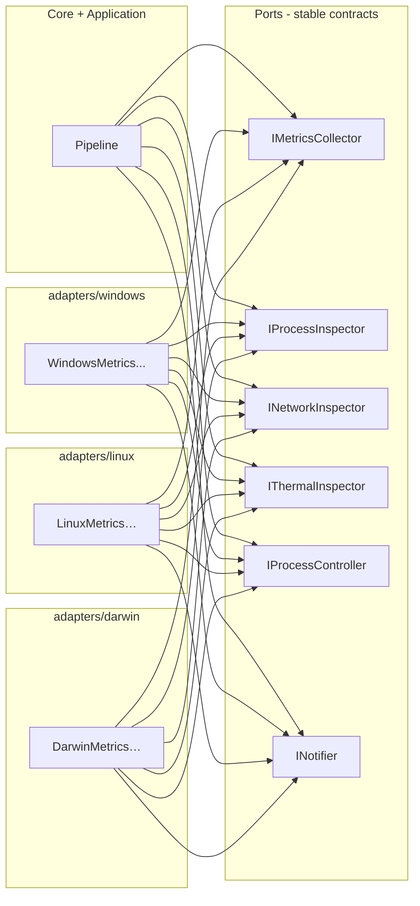
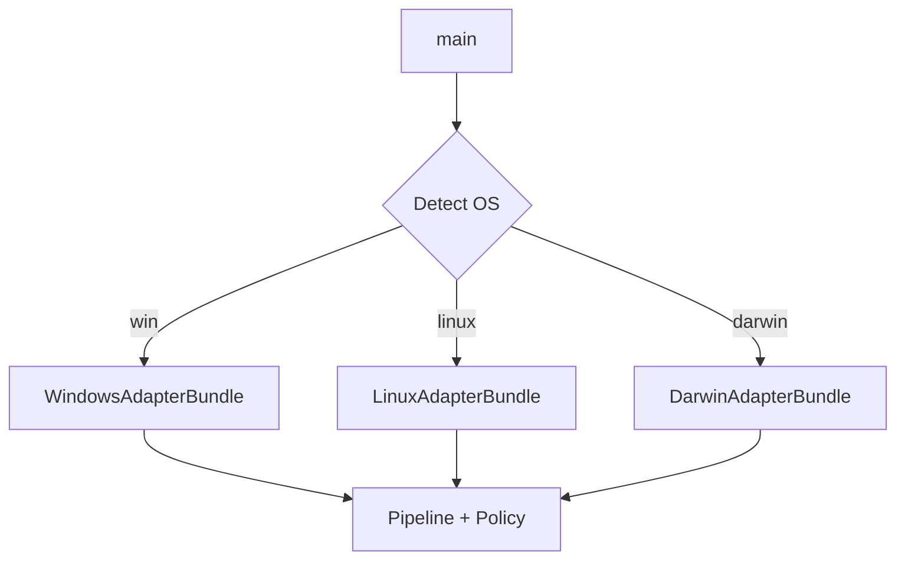

# Hexagonal (ports & adapters) design

The codebase follows **ports and adapters** (hexagonal architecture): **domain + application** depend on **abstractions**; **OS-specific code** lives in adapter packages and is swapped at startup.

## Why hexagonal here

| Benefit | Explanation |
|---------|-------------|
| **Cross-platform** | Same detection/diagnosis on Windows/Linux/macOS. |
| **Testability** | Feed synthetic snapshots into core without a real OS. |
| **Incremental delivery** | Ship Windows first; add Linux/macOS by implementing ports. |

## Package / module layout (language-agnostic)

```
core/
  model/           # Entities: snapshots, samples, signals, hypotheses
  detection/       # Thresholds, windows, sustained conditions
  diagnosis/       # Rules, scoring, correlation (pure logic)
  policy/          # Safety rules, cooldowns, allow/deny lists

application/
  pipeline/        # Tick loop: ingest → evaluate → emit intents
  services/        # Optional: baselines, incident history

ports/
  metrics.go       # or .py / .java — interface definitions only
  process.go
  network.go
  thermal.go
  actions.go
  notifier.go
  clock.go
  config.go

adapters/
  windows/
  linux/
  darwin/          # macOS

infra/
  buffer/          # Ring buffer, optional sqlite
  logging/
  config/

app/
  main.*           # Composition root: choose adapter bundle by OS / env
```

## Port diagram



## Composition root (startup)



Each **bundle** wires concrete implementations of all ports for that OS.

## Extension points

1. **New signal source** — implement a port (e.g. `IDockerInspector`) and register in pipeline.
2. **New diagnosis rule** — add pure function / rule in `core/diagnosis` + config toggle.
3. **New action** — extend `ActionIntent` enum + `IProcessController` per OS.
4. **New OS** — new `adapters/<os>/` package implementing existing ports; add bundle.

## Performance guardrails (adapter + pipeline)

- **Non-blocking collectors**: slow OS calls must not block the whole tick (timeouts, skip cycle).
- **Adaptive interval**: higher system pressure → slightly faster sampling; idle → slower.
- **Bounded memory**: ring buffer with fixed window (e.g. last 5–10 minutes aggregated).

See [03-data-contracts-and-pipeline.md](./03-data-contracts-and-pipeline.md) for pipeline sequence.
