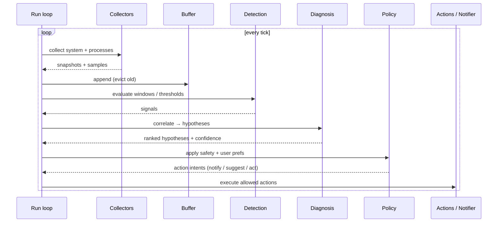
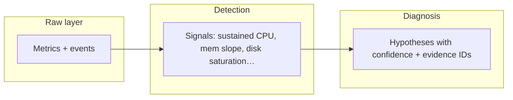

# Data contracts and pipeline

## Core domain models (stable across OS)

These are **normalized** after adapters; core logic only sees these types.

### SystemSnapshot

| Field | Description |
|-------|-------------|
| `timestamp` | Monotonic or UTC instant |
| `cpu_total_pct` | 0–100 aggregate |
| `mem_used_bytes`, `mem_total_bytes` | Physical memory |
| `swap_used_bytes` | If available |
| `disk_read_bps`, `disk_write_bps` | Aggregate or primary volume |
| `disk_queue_depth` | If available (strong signal for I/O wait) |
| `net_sent_bps`, `net_recv_bps` | Aggregate throughput |
| `thermal_c` | Optional; `null` if unsupported |
| `capabilities` | Flags: what this snapshot includes |

### ProcessSample

| Field | Description |
|-------|-------------|
| `pid`, `parent_pid` | |
| `name`, `exe_path` (optional) | |
| `cpu_pct` | Per-process CPU share |
| `rss_bytes` | Resident set size |
| `thread_count` | |
| `state` | running / sleeping / … (mapped enum) |

### Internal: rolling history

- **Ring buffer** of `SystemSnapshot` + per-PID `ProcessSample` series (last N minutes).
- Used for **sustained** conditions and **slopes** (e.g. memory leak: RSS rising over time).

## Pipeline sequence (main loop)

## Detection vs diagnosis

- **Detection**: cheap, rule-based, uses windows (e.g. “CPU > 85% for 60s”).
- **Diagnosis**: combines multiple signals (e.g. high CPU + low disk → different story than high CPU + high disk).

## Example correlation (conceptual)

| Signals | Hypothesis (example) |
|---------|----------------------|
| High CPU, high disk R/W | Indexing / large build / legit I/O |
| High CPU, flat disk, long duration | Possible tight loop / stuck worker |
| RSS rising, GC pressure (Java) | Possible leak |
| High disk queue, UI lag | I/O bottleneck |
| High temp, CPU capped | Thermal throttle |

Exact rules live in code/config; structure above stays stable.

## Action intents (output of policy)

Policy converts hypotheses into **typed intents**, never raw “kill pid” from diagnosis alone:

- `NOTIFY` — user-visible message + evidence snapshot id  
- `SUGGEST` — recommended steps (restart IDE, clear cache, …)  
- `SOFT_ACT` — renice, trigger graceful shutdown API if any  
- `HARD_ACT` — terminate (only if policy allows + cooldown + not protected)

See [05-safety-policy-and-actions.md](./05-safety-policy-and-actions.md).
