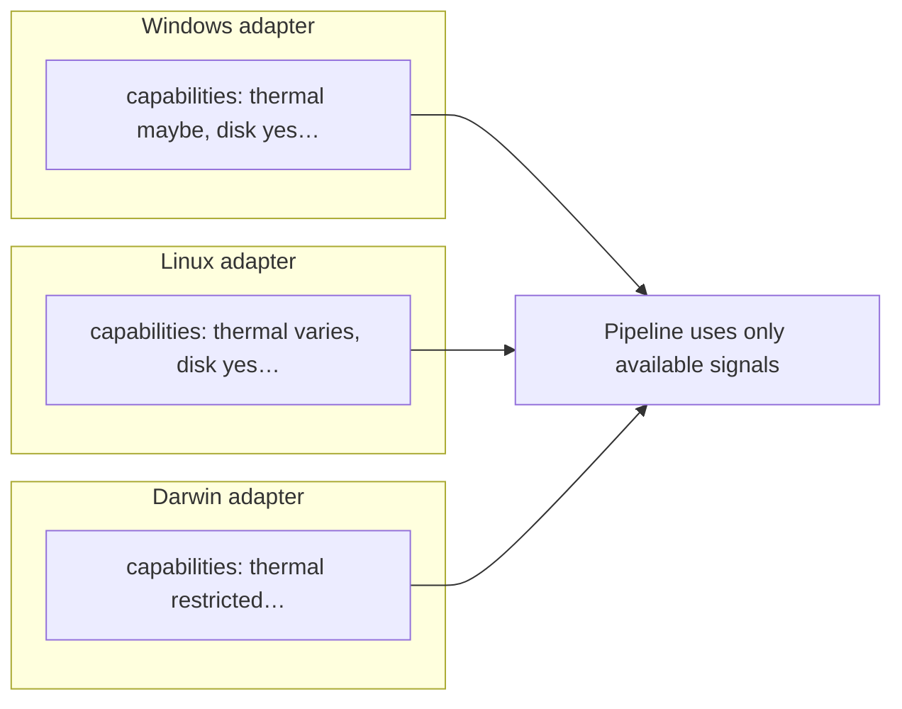

# Cross-platform adapters

Each OS implements the **same ports**. Internals differ; **outputs** match [data contracts](./03-data-contracts-and-pipeline.md).

## Adapter responsibility matrix

| Port | Responsibility |
|------|----------------|
| **IMetricsCollector** | System-wide CPU, memory, swap, disk throughput, optional queue |
| **IProcessInspector** | List processes + per-PID CPU/RAM/thread state |
| **INetworkInspector** | Throughput, optional connection counts / per-app share |
| **IThermalInspector** | CPU/package temperature if available; else report unsupported |
| **IProcessController** | renice, suspend/resume, terminate, optional “open UI” hooks |
| **INotifier** | Desktop toast / log / future UI |
| **IClock** | Injectable time for tests |

## OS implementation notes (reference only)

| Signal | Windows (first) | Linux (Ubuntu) | macOS |
|--------|-----------------|----------------|--------|
| CPU / process | PDH, WMI, `GetProcessTimes` | `/proc`, `procfs` | `proc_pidinfo`, host APIs |
| Memory | Working set, global mem | `MemAvailable` in `/proc/meminfo` | `host_statistics` / sysctl |
| Disk I/O | Performance counters | `/proc/diskstats`, `iostat` | `iostat`, IOKit |
| Network | counters, optional TCP tables | `/proc/net`, `ss` | `sysctl`, `netstat` |
| Thermal | WMI / OEM APIs where stable | `thermal_zone` | `powermetrics` / IOKit (permissions) |

Adapters should document **which APIs** they use and **permission** needs (especially macOS).

## Capability advertisement

Each adapter exposes **capabilities** so the pipeline does not assume thermal on every host:

## Bundle per OS

| Bundle | Packages |
|--------|----------|
| `WindowsAdapterBundle` | `adapters/windows/*` implementations |
| `LinuxAdapterBundle` | `adapters/linux/*` |
| `DarwinAdapterBundle` | `adapters/darwin/*` |

**Composition root** selects bundle by `cfg.os` or runtime detection.

## Parity checklist (when adding a second OS)

- [ ] Same `SystemSnapshot` / `ProcessSample` shape  
- [ ] Unit tests with **recorded** real snapshots (sanitized) per OS  
- [ ] Documented limitations (e.g. no thermal on VM)  
