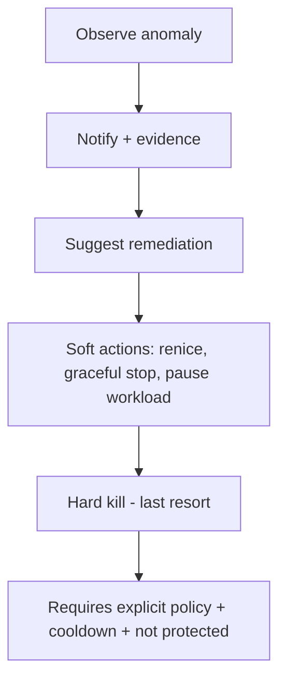
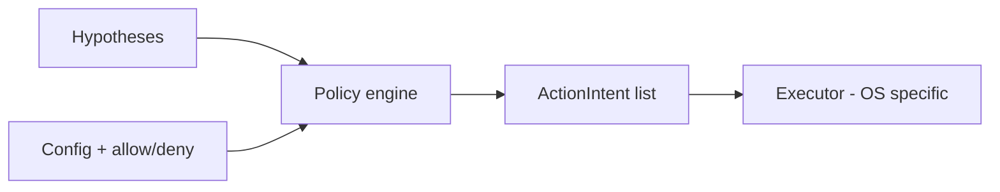

# Safety, policy, and actions

Automation that **terminates processes** can cause **data loss** or **system instability**. Policy is a **first-class** module.

## Action ladder (default)

Default product posture: **notify and suggest**; **auto-kill** only when explicitly enabled and heavily guarded.

## Policy inputs

| Input | Role |
|-------|------|
| **Hypothesis confidence** | Low confidence → never hard actions |
| **Severity** | User-defined thresholds |
| **Protected PIDs / names** | System processes, csrss, kernel, etc. |
| **Allowlist** | User apps never auto-killed (or higher bar) |
| **Cooldown** | Max N hard actions per hour |
| **User mode** | `safe` / `balanced` / `aggressive` (optional) |

## Never-kill / protect rules (conceptual)

- OS-critical services and session manager (platform-specific list per adapter).
- Processes running as **elevated** system roles without explicit user opt-in (configurable).
- **Children of protected parents** (optional rule).

Exact lists are **maintained per OS** in adapter config files, not hard-coded in core.

## Evidence bundle

Before any destructive action, store a small **evidence snapshot** (ids into ring buffer):

- Last K seconds of CPU/RAM/disk for system + target process  
- Reason string + hypothesis id  

Useful for **audit log** and **debugging false positives**.

## Diagram: policy in the loop

See [03-data-contracts-and-pipeline.md](./03-data-contracts-and-pipeline.md) for where policy sits in the pipeline.
