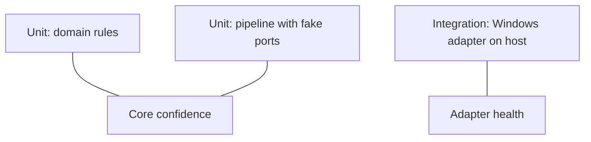

# Roadmap and testing

Language, libraries, and packaging choices live in [07-technology-stack.md](./07-technology-stack.md).

## Phased delivery

| Phase | Scope |
|-------|--------|
| **P0** | Interfaces, `SystemSnapshot` / `ProcessSample`, ring buffer, fake adapters for tests |
| **P1** | Windows: CPU, RAM, process list, basic disk/network aggregates |
| **P2** | Sustained thresholds, desktop/log notify, **no auto-kill** |
| **P3** | Multi-signal diagnosis + confidence + evidence refs |
| **P4** | Policy engine, renice / graceful stop, optional kill behind flag |
| **P5** | Linux adapter implementing same ports |
| **P6** | macOS adapter + capability gaps documented |

## Testing strategy

### 1. Core tests (OS-independent)

- Feed **synthetic time series** into detection/diagnosis/policy.
- **Golden files** for “given buffer state → expected signals/hypotheses”.

### 2. Adapter smoke tests (per OS, CI or manual)

- Process list non-empty, CPU in \[0,100\], memory plausible.
- Run on **VM** or **developer machine** job; don’t block CI if no runner.

### 3. Contract tests

- Adapter output conforms to schema (JSON schema or typed assertions).

## Documentation maintenance

When behavior changes:

1. Update the relevant doc under `doc/`.  
2. Add or adjust diagrams if a new layer or port is introduced.  
3. Keep **roadmap** phase table in sync with actual milestones.
