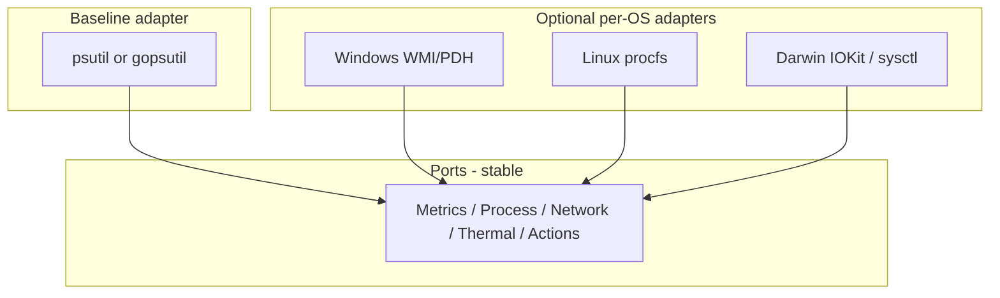
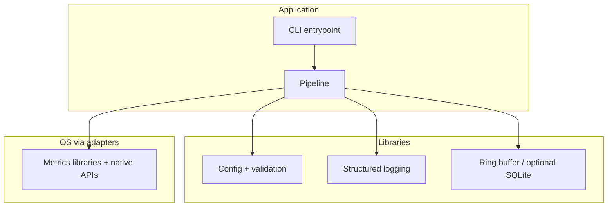

# Technology stack and tooling

This document records **language, libraries, packaging, and operational tooling** choices for the agent. Architecture (ports & adapters) stays the same regardless of language; this file answers **what we build it with**.

## Goals driving tooling

| Goal | Implication |
|------|-------------|
| **Cross-platform** | Prefer libraries with Windows / Linux / macOS support; native APIs only behind adapters. |
| **Extensible** | Clear modules, typed contracts (ports), config-driven behavior. |
| **Portable** | Single-user install, minimal host dependencies where possible. |
| **Readable** | Small, explicit modules over clever one-liners. |

## Language options (decision matrix)

| Language | Strengths for this project | Trade-offs |
|----------|----------------------------|------------|
| **Python 3.11+** | Fast iteration; **psutil** for CPU/RAM/processes/disk/net across OSes; excellent for rules and diagnosis logic; simple CLI. | Deployment is “script + venv” unless bundled; GIL rarely matters (workload is mostly I/O and periodic sampling). |
| **Go 1.22+** | Single static binary; strong concurrency; clean interfaces; great for long-running daemons. | OS-specific details can be more manual; slightly slower iteration than Python for exploratory rules. |
| **Rust** | Control, safety, performance. | Higher upfront cost for v1; more time on OS/FFI details. |
| **Java (JDK 21+)** | Familiar to JVM teams; strong typing; good for large rule sets. | Heavier runtime; OS integration often needs JNA/JNR or JNI; larger footprint for a “small agent”. |

### Recommended default (aligns with roadmap speed)

- **Primary recommendation:** **Python 3.11+** with **hexagonal layout** (ports/adapters), **psutil** in baseline adapters, optional **Windows/macOS/Linux-specific** adapters later for metrics not covered well by psutil (e.g. some thermal or queue-depth signals).

### Alternative (when single binary is the top priority)

- **Go** with the **same** architecture: ports as interfaces, `gopsutil` (or similar) for baseline metrics, per-OS packages for extras.

**Lock-in rule:** Pick **one** primary language for the repository’s reference implementation; rewrites in another language are possible only by preserving **port contracts** and **data models** (see [03-data-contracts-and-pipeline.md](./03-data-contracts-and-pipeline.md)).

## System metrics and OS integration

| Layer | Approach |
|-------|----------|
| **Baseline (all OSes)** | **psutil** (Python) or **gopsutil** (Go): CPU, memory, processes, disk, network in a unified model. |
| **Extended / finer signals** | Optional adapters: Windows (WMI, PDH, ETW), Linux (`/proc`, sysfs), macOS (IOKit, `sysctl`, sometimes CLI with permissions). |
| **Thermal** | Often **partial** per machine; adapters must expose **capabilities** (see [04-cross-platform-adapters.md](./04-cross-platform-adapters.md)) instead of fabricating values. |

## Configuration and policy storage

| Concern | Suggested tooling |
|---------|-------------------|
| **Human-editable config** | **YAML** or **JSON** (YAML preferred for comments and readability). |
| **Validation** | **Pydantic** (Python) or equivalent schema validation at startup — fail fast on bad thresholds or unknown keys. |
| **Secrets** | Avoid storing secrets in repo; optional OS keychain later — not required for v1. |

Config holds: sampling intervals, buffer sizes, thresholds, allow/deny lists, policy mode (`safe` / `balanced` / `aggressive`), and feature flags.

## Logging and local persistence

| Concern | Suggested tooling |
|---------|-------------------|
| **Structured logs** | **structlog** (Python) or **slog** (Go); optional JSON lines for file export. |
| **Incident / evidence history (later)** | **SQLite** — single file, portable, queryable; fits “evidence snapshot” and audit needs from [05-safety-policy-and-actions.md](./05-safety-policy-and-actions.md). |

The agent must remain lightweight: bounded buffers, rate-limited logging under stress.

## Packaging and distribution

| Scenario | Python | Go |
|----------|--------|-----|
| **Developer workflow** | `uv` or `pip` + virtual environment | `go build` |
| **End-user delivery** | **PyInstaller**, **briefcase**, or zip + embedded runtime | **Single binary** per platform |
| **Windows service / login startup** | Task Scheduler, **NSSM**, or a small service wrapper | Same patterns |

Choose packaging after the first stable CLI: “dev only” vs “sharable installer” drives the extra work.

## User interface (phased)

| Phase | UI |
|-------|-----|
| **v0–v1** | **CLI** only (status, dry-run, config path). |
| **Later** | Optional tray app or local web dashboard; technologies (e.g. Tauri, Electron, PyQt) are **out of scope** until core pipeline and policy are stable. |

## Testing toolchain

| Layer | Tooling |
|-------|---------|
| **Core (OS-independent)** | Synthetic `SystemSnapshot` / `ProcessSample` streams; golden expectations for detection/diagnosis/policy. |
| **Python** | **pytest** |
| **Go** | Standard `testing` package; **testify** optional |
| **Adapters** | Smoke tests on real hosts or manual checklist per OS; optional CI jobs when runners exist. |

Details align with [06-roadmap-and-testing.md](./06-roadmap-and-testing.md).

## Development environment (recommended)

| Tool | Role |
|------|------|
| **Git** | Version control |
| **Ruff** or **flake8** (Python) / **golangci-lint** (Go) | Lint |
| **mypy** (Python, optional) | Static typing |
| **pre-commit** (optional) | Hooks for format/lint |

Exact versions should be pinned in project files (`pyproject.toml`, `go.mod`) when the repository is initialized.

## Summary diagram (tooling layers)

## Open decisions (fill when implementation starts)

Record the final choices here to avoid drift:

| Decision | Options | Chosen |
|----------|---------|--------|
| Primary language | Python / Go / Java | **Python 3.10+** |
| Config format | YAML / JSON | **TBD** (next milestone) |
| Baseline metrics library | psutil / gopsutil / other | **psutil** (`PsutilAdapter`) |
| Packaging target | dev-only / single binary / installer | **dev / editable install** (`pip install -e ".[dev]"`) |

Repository bootstrapped: `pyproject.toml`, `src/self_healing_agent/`, tests under `tests/`.
