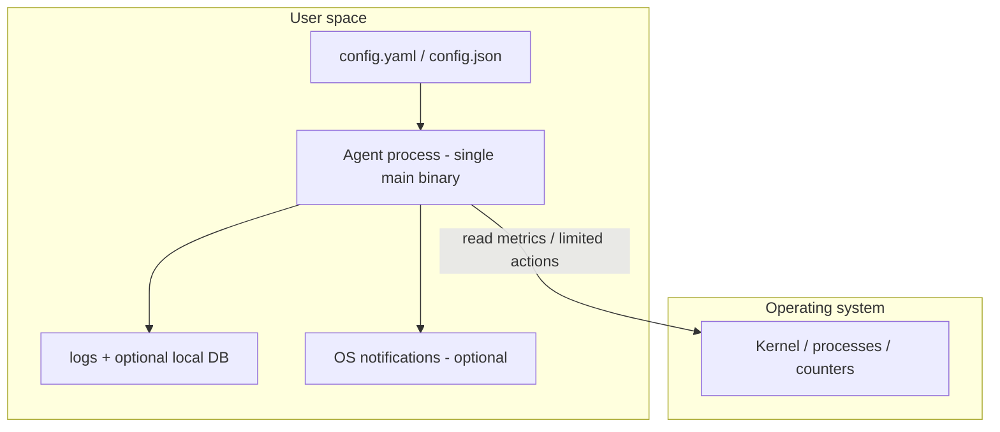

# Final product definition and runtime

This document **freezes what we are building for users** and **how it runs on a machine**, independent of programming language. Language choice (e.g. Go vs Python) only affects **packaging shape**, not the product idea.

## What the final product is

A **local background agent** (single user-facing “app” process) that:

1. **Observes** the computer: CPU, memory, disk, network, processes (and thermal where the OS allows).
2. **Detects** unhealthy or risky patterns (not one-off spikes only).
3. **Explains** likely causes with **evidence** (what was high, for how long, and why we think so).
4. **Acts safely**: by default **notify and suggest**; optional **soft actions** (e.g. lower priority); **hard kill** only behind explicit policy and guardrails.

It is **not** a cloud SaaS requirement for core use: metrics stay **on the machine** unless you later opt in to export.

**One-line pitch:** *A small watchdog that understands why your machine feels stuck — and helps you fix it without blindly killing apps.*

## What ships to the user (deliverables)

| Artifact | Purpose |
|----------|---------|
| **Executable** (or runtime + entry script) | Long-running agent + CLI |
| **Configuration file** | Thresholds, modes, allow/deny lists, sampling |
| **Log directory** (optional SQLite later) | Structured logs; optional incident/evidence history |
| **Documentation** | Install, run as background, config reference, safety |

Exact file names differ by stack (e.g. single `devguard.exe` vs `python -m agent` + venv).

## How it runs on “any one system” (mental model)

- **One main process** runs continuously (or on a schedule if you add that mode later).
- It **reads** public OS APIs (same role on Windows, Linux, macOS via **adapters**).
- It **writes** logs and optional local history; it may **show** desktop notifications if enabled.

## Modes of operation (product behavior)

| Mode | Description | Typical use |
|------|-------------|-------------|
| **Foreground / dev** | Run in a terminal; see logs; Ctrl+C stops | Development and debugging |
| **Background / daemon** | Runs detached; survives terminal close | Daily driver |
| **OS integration** | Starts at login or boot via OS scheduler | “Set and forget” |

v1 should support **foreground** clearly; **background** as documented; **auto-start** as platform-specific instructions (not necessarily one installer for all).

## User interaction surface (phased)

| Phase | User sees |
|-------|-----------|
| **v1** | **CLI**: `status`, `config validate`, `run`, optional `dry-run` |
| **v1** | **Notifications** (optional): “High memory pressure — IntelliJ using X MB” |
| **Later** | Tray icon or local dashboard — **not** required for the product to be “real” |

Core value is **diagnosis + safe guidance**, not a heavy UI.

## How a user runs it on each OS (target experience)

These are **integration patterns**, not implementation details.

### Windows

- Run: double-click or `agent.exe run`, or install as **Windows Service** / **Task Scheduler** “At log on”.
- May need **“Run as administrator”** only if you add actions that require elevation (keep optional).

### Linux (e.g. Ubuntu)

- Run: `./agent run` or package via `.deb` later.
- Background: **systemd user unit** (`systemctl --user enable agent`) for login start.

### macOS

- Run: `./agent run` from Terminal; background: **launchd** plist for login start.
- Some metrics may need **Full Disk Access** or other prompts — adapter documents **capabilities**, not fake data.

## What we are explicitly not promising in v1

- Fixing **hard kernel freezes** where the whole OS stops scheduling user processes (agent may not get CPU).
- **100% accurate root cause** every time — we ship **hypotheses + confidence + evidence**.
- **Silent auto-kill** of arbitrary apps — policy defaults to **safe** behavior.

## How this ties to language choice

| Concern | Product implication |
|---------|----------------------|
| **“Install on any machine”** | Users expect **one command or one binary**; Go maps naturally to a **single file**; Python maps to **runtime + deps** or a **bundled** build. |
| **“Runs in background”** | Same on all stacks: one long-lived process; OS wraps differ (Task Scheduler vs systemd vs launchd). |
| **“Same behavior on Win/Linux/macOS”** | Guaranteed by **ports + shared core**, not by language. |

When you pick Go vs Python, you are mainly choosing **artifact shape** (binary vs interpreter) and **iteration speed**, not changing the **final product definition** above.

## Summary

| Question | Answer |
|----------|--------|
| **What is it?** | Local observability + safe self-healing agent with evidence-based diagnosis. |
| **How does it run?** | One agent process + config + logs; optional OS notifications; optional auto-start via OS tools. |
| **How does the user start it?** | CLI first; background documented per OS; installer optional later. |

Update this document if the product scope changes (e.g. add mandatory cloud sync).
