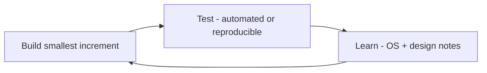

# Learning-first delivery process

This project is both a **shipping codebase** and a **structured way to learn how operating systems expose behavior** (CPU, memory, disk, network, processes). Code and docs follow one rule:

**Build a small slice → run tests → explain what the system is doing → only then move on.**

## Principles

| Principle | What it means in practice |
|-----------|---------------------------|
| **No feature without a test** | Every step adds or extends tests (unit for core, smoke for adapters). |
| **No step without “why”** | After each milestone, we pause on **concepts**: kernel vs user space, what a counter measures, limits of APIs. |
| **Thin vertical slices** | Prefer one working path (e.g. “read CPU + RAM once and log”) over many half-finished layers. |
| **Adapters teach the OS** | Port implementations are the place where we name **real** sources (e.g. PDH on Windows, `/proc` on Linux) and document quirks. |
| **Safe by default** | Learning includes **policy**: we do not automate destructive actions until the mental model is clear. |

## The loop (every step)

1. **Build** — Implement only what the current milestone needs (see [06-roadmap-and-testing.md](./06-roadmap-and-testing.md)).
2. **Test** — Prove behavior with tests or a fixed script; for OS code, document how to run smoke checks on your machine.
3. **Learn** — Short notes: *What did we ask the OS? What did we get back? What can go wrong?* Optional: add a “Learning notes” subsection in the PR/commit message or a running section in this doc.

## What “learn” covers (examples by layer)

| When we build… | We aim to understand… |
|----------------|------------------------|
| Process list + CPU/RAM | Processes, PIDs, threads, resident vs virtual memory, what “% CPU” means over an interval |
| Disk metrics | Read/write throughput vs queue / latency; why indexing feels like a “freeze” |
| Network | Connections vs bandwidth; when apps block on I/O |
| Thermal / throttling | Why high temperature reduces effective performance (not always “high CPU”) |
| Policy / kill | Signals vs TerminateProcess; protected processes; data-loss risk |

Deep dives stay **grounded in the code path** we just wrote, not abstract OS courses unless needed.

## Alignment with roadmap

Each phase in [06-roadmap-and-testing.md](./06-roadmap-and-testing.md) should end with:

- [ ] Tests green (or explicit manual checklist for host-only adapter tests).
- [ ] You can explain **in your own words** what that phase measures and what it does not measure.

## Pacing

- **Slow is fine** if understanding is the goal. Skipping tests to “go faster” usually hides gaps until production pain.
- If a topic is huge (e.g. ETW on Windows), we **narrow**: document “we use X for v1; Y is future work” and still ship a thin slice.

## Summary

| Goal | How we enforce it |
|------|-------------------|
| Working product | Roadmap + ports/adapters + tests |
| Deep learning | Learn step after each build; OS concepts tied to adapter code |
| Safety | Policy doc + no silent destructive automation in early phases |

This process is the default for all future steps unless we explicitly agree to spike-only experiments (then we still record what we learned or delete the spike).
