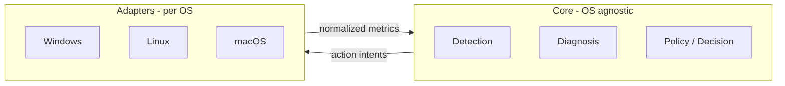

# Self-Healing / Local Observability Agent — Documentation

Cross-platform **observe → detect → diagnose → decide → act** agent. Core logic is OS-agnostic; **platform adapters** supply metrics and safe actions per operating system.

## Document index

| Doc | Description |
|-----|-------------|
| [01-architecture-overview.md](./01-architecture-overview.md) | Vision, goals, high-level system diagram |
| [02-hexagonal-design.md](./02-hexagonal-design.md) | Ports & adapters, module layout, extension points |
| [03-data-contracts-and-pipeline.md](./03-data-contracts-and-pipeline.md) | Domain models, time-series buffer, pipeline flow |
| [04-cross-platform-adapters.md](./04-cross-platform-adapters.md) | Windows / Linux / macOS adapter matrix and capabilities |
| [05-safety-policy-and-actions.md](./05-safety-policy-and-actions.md) | Guardrails, action ladder, never-kill rules |
| [06-roadmap-and-testing.md](./06-roadmap-and-testing.md) | Implementation order, testing strategy |
| [07-technology-stack.md](./07-technology-stack.md) | Language, libraries, packaging, config, logging, testing |
| [08-product-and-runtime.md](./08-product-and-runtime.md) | Final product definition, how it runs on a system, user-facing behavior |
| [09-learning-and-delivery-process.md](./09-learning-and-delivery-process.md) | Build → test → learn loop; pacing; what to understand at each layer |
| [10-milestone-p0-p1.md](./10-milestone-p0-p1.md) | First shipped slice: what exists in the repo + what to learn next |
| [11-milestone-p2.md](./11-milestone-p2.md) | P2: YAML config, sustained detection, log notifier |

## Quick mental model

**Current focus:** Windows implementation first; Linux and macOS plug in via the same **ports** (interfaces).
